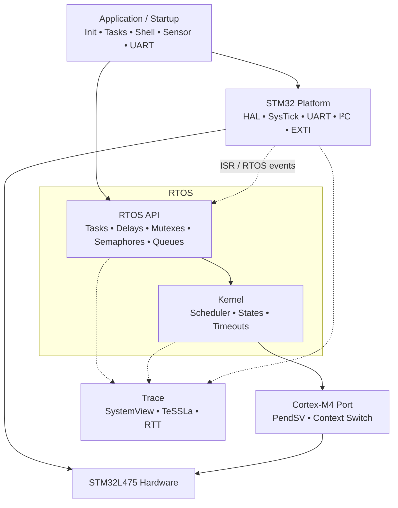
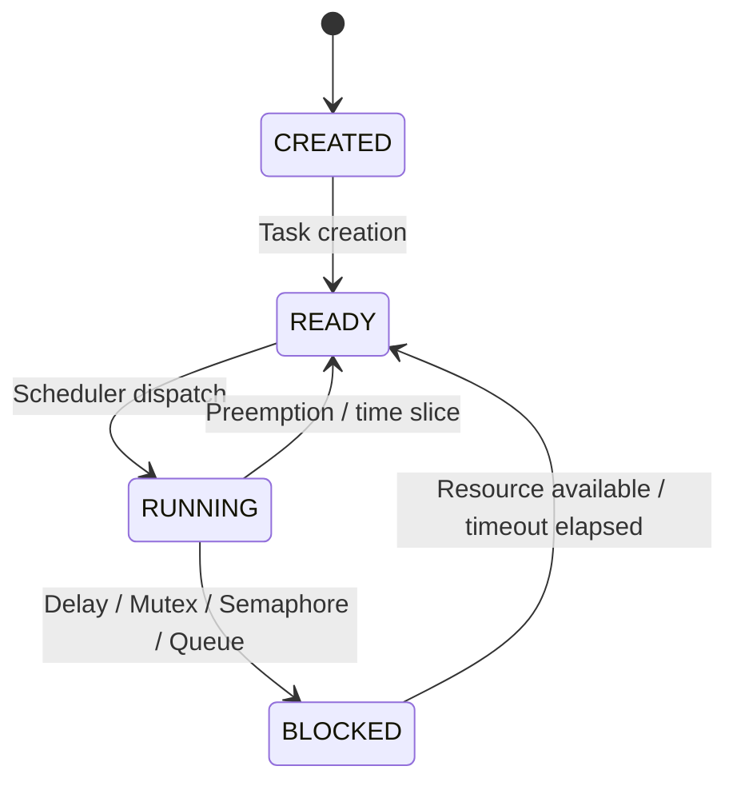
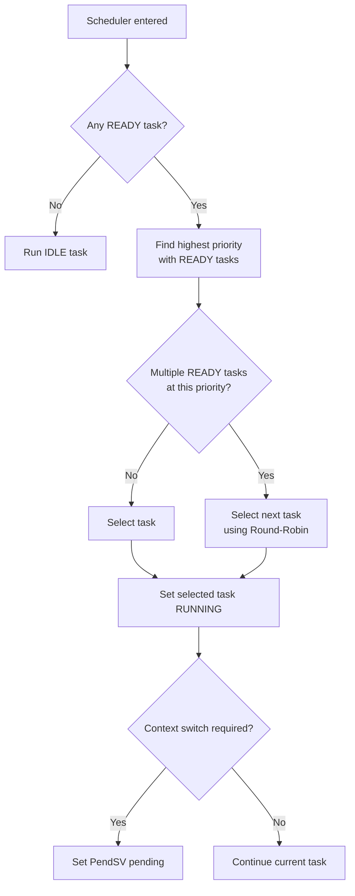
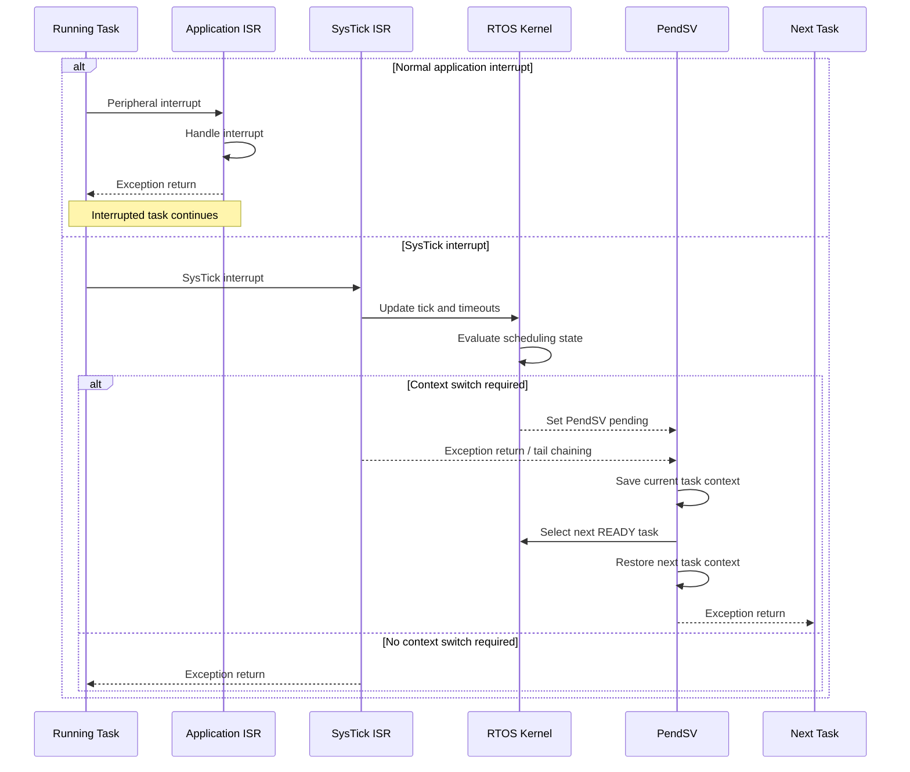
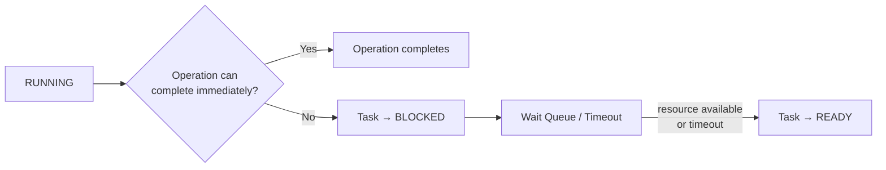
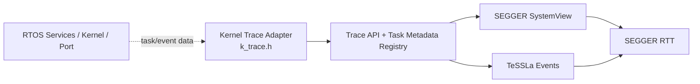

# RTOS Architecture

## Overview

The project implements a custom real-time operating system for the STM32L475 using a fixed-priority, preemptive Round-Robin scheduler.

The architecture is divided into four main parts:

- **Application / Test Tasks** use the RTOS services.
- **RTOS Services** provide the public interfaces for tasks, delays, mutexes, semaphores, and message queues.
- **Kernel** implements scheduling, task-state management, wait queues, and timeout handling.
- **Cortex-M4 Port** contains the architecture-specific SysTick, PendSV, and context-switch implementation.

A separate trace subsystem receives events from the RTOS services, kernel, and Cortex-M4 port. These events are used by SEGGER SystemView and TeSSLa and are transferred using SEGGER RTT.

## Overall Architecture

### Application / Test Tasks

Application and integration-test tasks access the RTOS through the same public service interfaces. This ensures that the integration tests exercise the actual RTOS implementation rather than separate test-specific code paths.

### RTOS Services

The RTOS services provide the interfaces used by application tasks:

- Task creation and management
- Blocking and non-blocking delays
- Mutexes
- Binary and counting semaphores
- Message queues
- Blocking, non-blocking, and timeout-based synchronization operations

If a blocking operation cannot complete immediately, the currently running task can be moved to the `BLOCKED` state until the required condition is satisfied or a timeout expires.

### Kernel

The kernel contains the internal mechanisms required by the RTOS services. Its main responsibilities are:

- Fixed-priority scheduling
- Round-Robin scheduling between tasks of equal priority
- Task-state management
- Ready-task management
- Wait queues
- Timeout handling
- Task Control Block management

The scheduler selects a ready task from the highest available priority. If multiple ready tasks exist at the same priority, they are scheduled using Round-Robin.

### Cortex-M4 Port

The Cortex-M4 port isolates processor-specific functionality from the kernel. It provides:

- SysTick handling
- PendSV handling
- Context save and restore
- Task stack handling
- Architecture-specific context switching

SysTick provides the RTOS time base and triggers time-related kernel processing. If a different task must execute, PendSV is set pending and performs the deferred context switch.

### Trace Subsystem

Tracing is implemented as a separate subsystem and does not form part of the normal scheduling or synchronization path.

Trace events can be generated by:

- RTOS service operations
- Kernel and task-state changes
- Scheduler activity
- ISR and Cortex-M4 port activity

The trace subsystem provides runtime information for SEGGER SystemView and TeSSLa. SEGGER RTT is used to transport the generated trace data.

## Task State Model

The RTOS uses the following valid task-state transitions:

| From | To | Reason |
|---|---|---|
| `CREATED` | `READY` | Task becomes available to the scheduler |
| `READY` | `RUNNING` | Scheduler dispatch |
| `RUNNING` | `READY` | Preemption or Round-Robin time slice |
| `RUNNING` | `BLOCKED` | Blocking RTOS operation |
| `BLOCKED` | `READY` | Resource becomes available or timeout expires |

A direct transition from `READY` to `BLOCKED` is invalid. A task can only enter the `BLOCKED` state while it is currently executing and invokes a blocking RTOS operation.

## Scheduler Architecture

The scheduler uses fixed task priorities. A ready task at a higher priority is selected before any ready task at a lower priority. If multiple ready tasks exist at the same highest priority, Round-Robin determines which task is selected next.

If no normal task is ready, the IDLE task is selected. Otherwise, the scheduler determines the highest priority containing ready tasks and selects either the only available task or the next task according to Round-Robin.

The diagram describes task selection only. The architecture-specific context switch itself is handled separately by the Cortex-M4 port using PendSV.

## Interrupt and Context-Switch Flow

Task switching is deferred to the PendSV exception. SysTick updates the RTOS time base and allows the kernel to determine whether a scheduling change is required.

If the scheduler does not require a task switch, execution returns to the interrupted task. If a switch is required, PendSV is set pending and may execute directly through exception tail chaining. PendSV saves the current task context, activates the next task, restores its context, and returns to thread execution.

Normal application ISRs do not perform a context switch directly. Instead, RTOS-aware ISRs may request rescheduling before exception return, typically by pending PendSV. If that scheduling decision selects a different READY task, the Cortex-M4 exception mechanism can transition from the current ISR to PendSV through tail-chaining, allowing the context switch to occur before thread-mode execution resumes. SysTick follows the same deferred context-switch mechanism while also providing the RTOS time base.

## Synchronization and Blocking

Mutexes, semaphores, delays, and message queues share the same basic blocking behavior when an operation cannot complete immediately.

If an operation can complete immediately, the task continues without entering the `BLOCKED` state. Otherwise, the running task is blocked and waits either for the required resource or for a configured timeout.

Blocked tasks are later returned to the `READY` state when their wake-up condition is satisfied. Synchronization objects use the kernel's waiting mechanisms, including priority-based waiter selection where required. Message queues additionally maintain FIFO ordering for stored messages.

## Verification Architecture

Runtime events generated by the RTOS are forwarded through a common trace interface. The same trace infrastructure provides data for both runtime visualization and specification-based verification.

The dependency direction is intentionally one-way: **Kernel → Trace → Backend**. `k_trace.h` is the kernel-side adaptation boundary that converts `kernel_task_t`/TCB information into backend-independent task references and metadata. `trace.h` and `trace.c` do not include `kernel_task.h` or `tcb.h` and never query scheduler state.

Task metadata is copied into a small trace-owned registry when each task is created. SystemView's `pfSendTaskList` callback replays this registry when a recording starts or restarts, so task information remains available even when the host connects after task creation. The idle task is retained in the registry for TeSSLa state verification but is not registered as a normal SystemView task; idle execution is represented through `SEGGER_SYSVIEW_OnIdle()`.

The instrumentation supports observation and verification of:

- Scheduler priority ordering
- Round-Robin behavior
- Task-state transitions
- IDLE execution
- Delay timing
- Mutex ownership and wake-up behavior
- Semaphore state and wake-up behavior
- Message-queue capacity, FIFO ordering, blocking behavior, and data integrity
- ISR execution behavior

## Reference

* [STMicroelectronics, *PM0214 — STM32 Cortex-M4 MCUs and MPUs Programming Manual*, Rev. 10, Section 2.3.7 "Exception entry and return", p. 42](https://www.st.com/resource/en/programming_manual/pm0214-stm32-cortexm4-mcus-and-mpus-programming-manual-stmicroelectronics.pdf) — describes Cortex-M4 tail-chaining: when an eligible exception is pending at completion of an exception handler, the stack pop is skipped and control transfers directly to the new exception handler.
