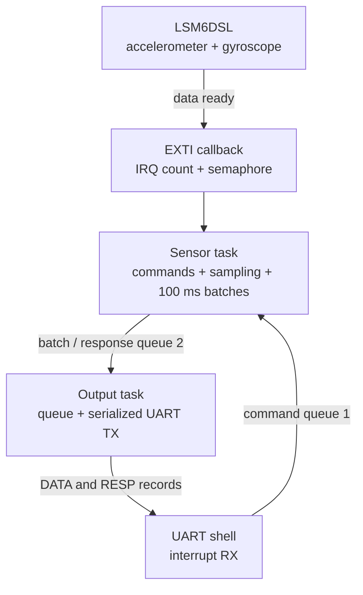

# LSM6DSL sensor application

**Author:** Jerome

`PROJECT_SENSOR` runs an interrupt-driven accelerometer and gyroscope application on the STM32L475. It samples the onboard LSM6DSL, averages readings over fixed 100 ms periods, streams CSV records over UART, and accepts commands on the same UART.

## Architecture



The priority-6 sensor task owns normal device access. Data-ready interrupts release a binary semaphore; shell commands also release it so commands are handled without waiting for a sample. Queue 1 stores up to eight commands.

The task accumulates converted six-axis samples and publishes on an absolute 100 ms deadline. Its semaphore timeout is the time remaining until that deadline, which keeps the UART period independent of the selected sensor rate. The priority-5 output task drains queue 2 (capacity 96) and is the single owner of normal UART transmission, preventing sensor data and responses from being interleaved.

## Modes and output

| Mode | LSM6DSL rate | Power mode | Typical samples per record |
| --- | ---: | --- | ---: |
| `low` | 52 Hz | Low power | 5-6 |
| `normal` | 104 Hz | Normal | 10-11 |
| `high` | 416 Hz | Normal | 40-42 |

Streaming starts enabled. Each non-empty batch is averaged and emitted as:

```text
DATA,ax_g,ay_g,az_g,gx_dps,gy_dps,gz_dps,samples
```

Acceleration values are in g, angular rates are in degrees per second, and each value is printed with three fractional digits. `trace_transmission_complete` marks each outgoing data record for timing verification.

## Commands

| Command | Effect |
| --- | --- |
| `help` | List all commands. |
| `status` | Report `CTRL1_XL`, `CTRL2_G`, interrupt, read, and dropped-sample counters. |
| `mode low` | Select 52 Hz low-power sampling. |
| `mode normal` | Select 104 Hz normal sampling. |
| `mode high` | Select 416 Hz sampling. |
| `stream on` / `stream off` | Enable or suppress periodic `DATA` records. |
| `reset` | Software-reset and reinitialize the sensor. |
| `led on` / `led off` | Set the board LED manually. |

Device commands are asynchronous. Their completion is returned as `RESP,...` or `ERROR,...` records. The firmware emits no command prompt because the host terminal provides `cmd>` locally. Runtime failures increment the debugger-visible `test_error_count` and turn on the board LED. Initialization checks are also reported through `g_integration_test_result`.

## Host tools

- [Interactive sensor terminal](../../sensor_terminal/README.md) displays the
  latest data and makes commands easy to enter.
- [Graphical sensor visualization](../../sensor_viewer/README.md)
  explains how to view the sensor stream graphically.
